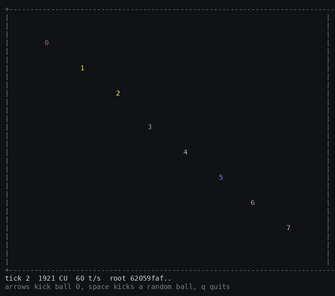

# tickpruv

Verifiable game engine for Solana. Game logic compiles to SBF, runs off-chain
at full speed in an embedded VM, and any disputed tick can be replayed by the
chain itself - the L1 already executes SBF natively, so the final step of a
dispute is just a program invocation. No interpreter-in-a-contract, no zkVM.



Early WIP.

- `crates/tick-core` - no_std deterministic tick primitives: Q32.32 fixed
  point, xorshift64* rng, the `TickLogic` trait
- `crates/merkle` - chunked sha256 merkle tree over game state; the same
  verify path runs on-chain
- `crates/runtime` - off-chain engine; drives the SBF build through the
  real agave program runtime (via mollusk), keeps the input log, produces
  tick-indexed state-root checkpoints
- `games/arena` - minimal physics arena used as the reference game
- `programs/arena-program` - thin on-chain wrapper: a tick instruction
  plus a state-load instruction the referee uses to seed replay scratch
  accounts
- `programs/referee` - the dispute program: operators assert tick-indexed
  checkpoints, a challenger bonds and bisects down to the single tick
  where the parties diverge, and that tick is replayed on-chain via CPI
  into the actual game program
- `programs/wager` - trustless stake escrow on top of the referee: two
  players lock lamports, play off-chain, and settle either by co-signing
  the result or by proving the final checkpoint through the referee; the
  game program itself names the winner (a Verdict CPI over the proven
  state), so no server, oracle or opponent is ever trusted with the pot

```
cd programs/arena-program && cargo build-sbf && cd ../..
cd programs/referee && cargo build-sbf && cd ../..
cargo test
```

To watch it run, `cargo run -p arena-viewer --release` plays the arena
live in the terminal at 60 ticks per second, every tick executed through
the real program runtime, with the would-be checkpoint root in the HUD.
Arrow keys kick ball 0 around.

Current numbers:

- an arena tick costs at most ~2000 CU under the real agave runtime (via
  mollusk); the SBF build matches the native build bit for bit over a
  thousand ticks of randomized input
- the engine pushes ~17k ticks/s through the full runtime pipeline
  off-chain, room for hundreds of 60 Hz sessions per core
- the full one-step proof - pre-state root check, input chain check, CPI
  state load, native CPI tick execution, post-state root, payout - lands
  at ~19k CU, about 1.4% of one transaction's compute budget
- complete scripted disputes on devnet (cheating operator): a 16-tick
  range settles in 12 transactions / ~23 s / 125k lamports, a 256-tick
  range in 20 transactions / ~26 s / 205k lamports - the log-scaling is
  visible in practice. both times the bisection cornered the injected
  lie exactly and the cluster's native replay matched the locally
  computed trace bit for bit (`tools/devnet-dispute` reproduces it)
- the comparison that motivates the design: interpreting sbpf inside a
  contract costs 80+ CU per emulated instruction even with a deliberately
  minimal interpreter (`programs/interp-bench`), so re-executing the same
  tick interpreted starts at ~157k CU before memory proofs, against 19.5k
  CU for the entire native one-step proof; an SP1 Groth16 verify alone is
  ~280k CU
- state root cost scales linearly at ~11 CU/byte (`programs/root-bench`),
  so even an 8 KB game state keeps the replay instruction under 15% of
  one transaction's compute budget
- real staked matches settle trustlessly on devnet (`tools/devnet-match`):
  the honest path - escrow both stakes, assert the final checkpoint, sit
  out the challenge window, settle - takes 6 transactions / ~31 s / 65k
  lamports in fees, with the settle instruction (root check + LoadState +
  Verdict CPIs + payout) at ~13k CU. the adversarial path (`--cheat`,
  the reporter lies about the result) runs the full machinery for real:
  challenge, 5 bisection rounds cornering the lie at the exact tick,
  native replay convicting the cheater, then honest settlement - 20
  transactions / ~47 s, the cheater's bond goes to the challenger and
  the pot still goes to whoever actually won the game

## Credits

Core protocol and distributed systems architecture by [@nzengi](https://github.com/nzengi).
